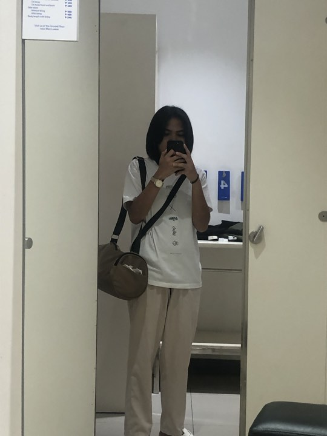

My personal website:
Purpose and Descrption:
The purpose of the website to be to introduce Kayel Latayan, showcasing various aspects of their life, interests, and contact information. To share my life experiences that I know some of them we can relate to because you may have experienced them too. 

Features:
Navigation: The website has a navigation bar allowing users to navigate to different sections of the website.
Sections: It's divided into several sections such as Home, Facts, About, and Contact, each providing different information about Me.
Content: Each section contains information about Kayel's interests, experiences, and contact details.
Styling: The website is styled using CSS to create a visually appealing and responsive layout.

Technology Used:
HTML
CSS
Javascript

external resources or libraries:
Google Fonts: Used to import font families for styling.
Social Media Links: Links to Kayel's social media profiles like Facebook, Instagram, TikTok, and Twitter i link my social media account at the bottom if you click na name of the social media account.
Ensure that you have an active internet connection to load the Google Fonts and social media profiles properly.

For the style.css file, I created the designs for my website by specifying the font size and box sizes. To put it more simply, you should always create section ids that you name in index.html, which will contain the section that contains the div class, because it is 
The texts that make up your website's content and this style.css will only be called when you specify section IDs in index.html; these should also be the correct IDs to call in order to retrieve the outputs from the style.css. 
Additionally, you may manage the look of your website own because the CSS style allows you to adjust font size, width, animations, padding, margins, and other elements. and i used a simple java script with the name app.js for my nav-list and it serves as my selector for my ul to run my function.and use other gaming background image to my web because i think its a good idea because the background is one of the attraction of the user especially if you love the character or you are game lover i think so hehe :>I also have a very interesting and interesting animation that I think will be relevant the button at the top if you swipe slowly down it .

Sir this is my code po pag bootsrap hindi po yan ang nilagay ko sir kasi nawawala yong mga laman na text at yong box kapag pinindot yong bilog sa gilid na bilog yong mga home,aboutme,facts,contact-info
 
<!doctype html>
<html lang="en">
    <head>
        <title>Title</title>
        <meta charset="UTF-8">
        <meta name="viewport" content="width=device-width, initial-scale=1.0">
        <link rel="stylesheet" href="style.css">
        <link rel="preconnect" href="https://fonts.googleapis.com">
        <link rel="preconnect" href="https://fonts.gstatic.com" crossorigin>
        <link href="https://fonts.googleapis.com/css2?family=Jersey+15&family=Montserrat:ital,wght@0,100..900;1,100..900&family=Oswald:wght@200..700&display=swap" rel="stylesheet">
        <link href="https://www.facebook.com/latayankate?mibextid=LQQJ4d">
        <link href="https://www.instagram.com/kayel_latayan?igsh=N2FvYzlia2x5dGR0&utm_source=qr">
        <link href="https://www.tiktok.com/@yaa.its.ur_primero?_t=8mCScdngRHe&_r=1">
        <link href="https://twitter.com/kayel_latayan">
    
        <!-- Required meta tags -->
        <meta charset="utf-8" />
        <meta
            name="viewport"
            content="width=device-width, initial-scale=1, shrink-to-fit=no"
        />

        <!-- Bootstrap CSS v5.2.1 -->
        <link
            href="https://cdn.jsdelivr.net/npm/bootstrap@5.3.2/dist/css/bootstrap.min.css"
            rel="stylesheet"
            integrity="sha384-T3c6CoIi6uLrA9TneNEoa7RxnatzjcDSCmG1MXxSR1GAsXEV/Dwwykc2MPK8M2HN"
            crossorigin="anonymous"
        />
    </head>

    <body>
        <header>
            <section id="header">
                

                    

                        

                            <a href="#kayel"><h1>KaYel  Latayan</h1></a>
                        
        
                        

                            

                            <ul>
                               <li><a href="#" data-after="Sariliko">Home</a></li>
                               <li><a href="#"data-after="Katotohanan">Facts</a></li>
                               <li><a href="#"data-after="Chismosa To!">Aboutme</a></li>
                               <li><a href="#"data-after="Tawagan nyoko">Contact-info</a></li>
    
                            </ul>
                        

                    

                

            </section>
            <section id="kayel">
                

        

             <h1>Hi Hello, Hello Hi!  </h1>
             <h1>My Name is </h1>
             <h1>KAYELLL</h1>
            <a href="#" type="button" class="cta">*My Personal Website*</a>
                 

                  

                  </section>
         
        
                 <section id="facts">
                 

                  

                 <h1 class="section-title">3 Facts About me</h1>
                  
 •When I'm struggling, I don't give up on life bacause I'm going to attempt,
                     no matter how difficult, to improve because this is the only time we'll be able to do it. 

                  
•My love for cars may stem from the fact that they are something
                     I hope to get in the future. As they say, dream big since these things are for the good times ahead.

                  
•I love painting because, well, I think I love drawing. My greatest desire is to become
                     a well-known artist that the world would recognize
                     since, in my opinion, those who are gifted with drawing are special because of their experiences in life. 

                     

        
                       

                     

                     

                     

                     <h2>I like gaming</h2>
                      
Since my childhood, I have enjoyed playing online games, possibly as a way to escape the harsh realities of life. 
                      I am pleased to have succeeded in trying something that I was previously unable to do You can perform better, they continue
                      And playing with me is one of the ways we try to make innovative experiences
                      because for me the experience is an important part of life that will never be repeated but never returned.

                       

                       

        
                      

                        

                     

                     <h2>I like adventure Like biking</h2>
                      
I enjoy a good, exciting life, which is why riding a bike is one of my passions. 
                      Riding a bike with friends is an amazing experience that can never be replaced by going on an adventure,
                       as we always have fun when we are together because our friends are there for us no matter what. We are sympathetic..

                     

        
                     

                     

                     

                      <h2>kind to others</h2>
                      
  And I am the one who is always willing to lend a helping hand to others.
                         If there is anything I can do, I will do it because I feel bad for those who don't have enough food for the day,
                           especially the elderly who don't have access to food or shelter. I also sometimes give what I have because
                           I believe that even though we have more sophisticated problems in life, there are those who are struggling more
                          than we are, so we should try to help others too. 
                       

                     

                   

                

              </section>
        
        
        <section id="about">
            

                

                    

                        
                    

                

                

                    <h1 class="section-title">About my self</h1>
                     <h2>Student</h2>
                       
 Hi! Im Kate Anne Charisse L. Libao.

                          
 •2003 and My sodiac sign is a Cancer

                          
•My birthday is July 22

                          
•My favorite color is Black and White

                          
•My favorite Food is Nuts,pizza

                          
•And  have a pet name "Milky"

                             
•Currently Studying the Program of 
                                Bachelor of Science in Information Technology at NU-LIPA  

                                
•From Padre Garcia Batangas the Cattle Capital Trading of the Philippines

                                 
•My moto in life is "A little Process Still a Progress"

                        <a href="#" class="cta">Whats My Nickname Again?</a>
                

            

        </section>
        
        
        <section id="contact">
            

                
<h1 class="section-title">Contact information:</h1>

            

            

                

                

                    <h1>Phone Number</h1>
                    <h2>+ 095 1924 5269</h2>
                    <h2>+ 099 8426 3802</h2>
                

            

            

                

                

                    <h1>Gmail</h1>
                    <h2>katelatayan22@gmail.com</h2>
                    <h2>latayankate08@gmail.com</h2>
                

            

            

                

                

                    <h1>Home Town</h1>
                    <h2>Batangas City</h2>
                    <h2>Padre Garcia Batangas</h2>
                

            

        

        

        </section>
           <!-- place navbar here -->
        </header>
        <main></main>
        <footer>

            <section id="footer">
                

                    
<h1> Kayel latayan :></h1>

                    <h2>For more Info contact us:</h2>
                    

                        

                            <a href="https://www.facebook.com/latayankate?mibextid=LQQJ4d">Facebook</a>
                            
                        

                        

                            <a href="https://www.instagram.com/kayel_latayan?igsh=N2FvYzlia2x5dGR0&utm_source=qr">Instagram</a>
                            </a>
                        

                        

                            <a href="https://www.tiktok.com/@yaa.its.ur_primero?_t=8mCScdngRHe&_r=1">Tiktok</a>
                            
                        

                        

                            <a href="https://twitter.com/kayel_latayan">Twitter</a>
                            
                        

                    

                    
Thanks this is my Personal website i hope you Enjoy to my personal experience!

                    
See You Next Time!

                

            </section>
 <!-- place footer here -->
        </footer>
        <!-- Bootstrap JavaScript Libraries -->
        

        
    </body>
</html>

